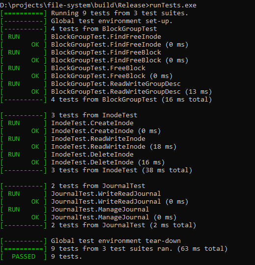
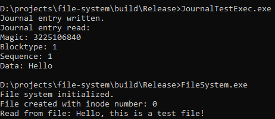

# File System Project

## Table of Contents

1. [Overview](#overview)
2. [Components](#components)
   - [BlockGroup](#blockgroup)
   - [Inode](#inode)
   - [Journal](#journal)
3. [File System Operation](#file-system-operation)
4. [Main Function Explanation](#main-function-explanation)
5. [Running the Project](#running-the-project)
6. [Unit Tests](#unit-tests)

## Overview

This project implements a basic file system simulation using several core components: `BlockGroup`, `Inode`, and `Journal`. These components work together to manage file storage, access, and logging within a simulated disk environment. The project includes unit tests to ensure the functionality of these components.

## Components

### BlockGroup

#### Real-Life Usage
In a real file system, `BlockGroup` is used to manage groups of blocks on the disk, ensuring efficient space allocation and management.

#### Code Structure
The `BlockGroup` class includes:
- **Attributes**:
  - `disk`: The disk file used for storage.
  - `groupDesc`: A structure that holds the block group descriptor information.
- **Methods**:
  - `findFreeInode`: Scans the inode bitmap to find the first free inode.
  - `findFreeBlock`: Scans the block bitmap to find the first free block.
  - `freeBlock`: Marks a block as free in the bitmap.
  - `readGroupDescFromDisk`: Reads the block group descriptor from the disk.
  - `writeGroupDescToDisk`: Writes the block group descriptor to the disk.

**Code Details**:
```cpp
class BlockGroup {
public:
    // Structure to hold block group descriptor information
    struct Ext4GroupDesc {
        uint32_t bg_block_bitmap;
        uint32_t bg_inode_bitmap;
        uint32_t bg_inode_table;
        uint16_t bg_free_blocks_count;
        uint16_t bg_free_inodes_count;
        uint16_t bg_used_dirs_count;
        uint16_t bg_flags;
        uint32_t bg_reserved[3];
    };

    BlockGroup(const std::string &disk);

    int findFreeInode(const std::vector<bool> &inodeBitmap);
    int findFreeBlock(const std::vector<bool> &blockBitmap);
    void freeBlock(std::vector<bool> &blockBitmap, int blockIndex);
    void readGroupDescFromDisk(uint32_t groupDescIndex);
    void writeGroupDescToDisk(uint32_t groupDescIndex);

    // Getters and setters
    Ext4GroupDesc &getGroupDesc() { return groupDesc; }

private:
    std::string disk;
    Ext4GroupDesc groupDesc;
};
```

### Inode

#### Real-Life Usage
Inodes are used to store metadata about files, such as their size, permissions, and locations on the disk.

#### Code Structure
The `Inode` class includes:
- **Attributes**:
  - `disk`: The disk file used for storage.
  - `inodeTableStart`: The starting location of the inode table on the disk.
  - `inode`: A structure that holds the inode information.
- **Methods**:
  - `createInode`: Initializes an inode with specified attributes.
  - `readInodeFromDisk`: Loads inode data from the disk.
  - `writeInodeToDisk`: Saves inode data to the disk.
  - `deleteInode`: Marks an inode as deleted by setting the deletion time.

**Code Details**:
```cpp
class Inode {
public:
    // Structure to hold inode information
    struct Ext4Inode {
        uint16_t i_mode;
        uint16_t i_uid;
        uint32_t i_size;
        uint32_t i_atime;
        uint32_t i_ctime;
        uint32_t i_mtime;
        uint32_t i_dtime;
        uint16_t i_gid;
        uint16_t i_links_count;
        uint32_t i_blocks;
        uint32_t i_flags;
        uint32_t i_block[15];
    };

    Inode(const std::string &disk, uint32_t inodeTableStart);
    void createInode(uint16_t mode, uint32_t size);
    void readInodeFromDisk(uint32_t inodeNumber);
    void writeInodeToDisk(uint32_t inodeNumber);
    void deleteInode();

    // Getters
    const Ext4Inode &getInode() const { return inode; }

private:
    std::string disk;
    uint32_t inodeTableStart;
    Ext4Inode inode;
};
```

### Journal

#### Real-Life Usage
Journaling is used to ensure data integrity and consistency by logging changes before they are applied.

#### Code Structure
The `Journal` class includes:
- **Attributes**:
  - `disk`: The disk file used for storage.
- **Methods**:
  - `writeJournal`: Logs changes to the disk.
  - `readJournal`: Retrieves logged changes.
  - `manageJournal`: Ensures the journal does not overflow by managing its size.

**Code Details**:
```cpp
class Journal {
public:
    // Structure to hold journal header information
    struct Ext4JournalHeader {
        uint32_t j_magic;
        uint32_t j_blocktype;
        uint32_t j_sequence;
    };

    // Structure to hold a journal entry
    struct JournalEntry {
        Ext4JournalHeader header;
        std::vector<char> data;
    };

    static const uint32_t MAGIC_NUMBER = 0xC03B3998;

    Journal(const std::string &disk);
    void writeJournal(const JournalEntry &entry);
    void readJournal(std::vector<JournalEntry> &entries);
    void manageJournal(std::vector<JournalEntry> &entries, size_t maxEntries);

private:
    std::string disk;
};
```

## File System Operation

The file system uses `BlockGroup`, `Inode`, and `Journal` to manage file storage and access:

1. **Initialization**: The disk is initialized with zeros or predefined data.
2. **File Creation**: An inode is created to represent the file, and its metadata is stored.
3. **Data Storage**: Blocks are allocated to store the file's data.
4. **Logging**: Changes are logged in the journal to ensure consistency.
5. **Access**: The file system can read and write data using the inode and block information.
6. **Deletion**: Inodes and blocks are managed to free space as needed.

## Main Function Explanation

The `main` function initializes the file system, creates a file, writes data to it, reads the data back, and optionally deletes the file. Here is a step-by-step explanation:

1. **Initialization**: The disk is initialized, and the file system is set up.
2. **File Creation**: A file is created with specific permissions and size.
3. **Data Writing**: Data is written to the file's blocks.
4. **Data Reading**: The file's data is read back from the blocks.
5. **Optional Deletion**: The file can be deleted, freeing its inode and blocks.

## Running the Project

To run this project, you need to have CMake and a C++ compiler installed on your system.

### Steps to Install CMake

1. **Download CMake**:
   - Go to the [CMake download page](https://cmake.org/download/) and download the appropriate installer for your operating system.

2. **Install CMake**:
   - Follow the instructions provided in the installer to install CMake on your system.

3. **Verify Installation**:
   - Open a terminal or command prompt and type `cmake --version` to verify that CMake is installed correctly.

### Building the Project

1. **Clone the Repository**:
   - Clone the project repository to your local machine.

2. **Create a Build Directory**:
   - Create a directory named `build` in the project root directory.

3. **Generate Build Files**:
   - Open a terminal or command prompt, navigate to the `build` directory, and run:
     ```sh
     cmake ..
     ```

4. **Build the Project**:
   - Run the following command to build the project:
     ```sh
     cmake --build . --config Release
     ```

## Unit Tests

The project includes comprehensive unit tests to verify the functionality of `BlockGroup`, `Inode`, and `Journal`. These tests ensure that each component behaves as expected under various conditions.

### Running Unit Tests

1. **Build the Tests**:
   - The tests are built along with the main project. Ensure you have followed the building steps mentioned above.

2. **Run the Tests**:
   - After building the project, run the test executable to execute all unit tests:
     ```sh
     ./runTests
     ```

### Test Results




For detailed explanations of each test case and the expected results, refer to the [Test Explanation](tests/tests_details.md) document.